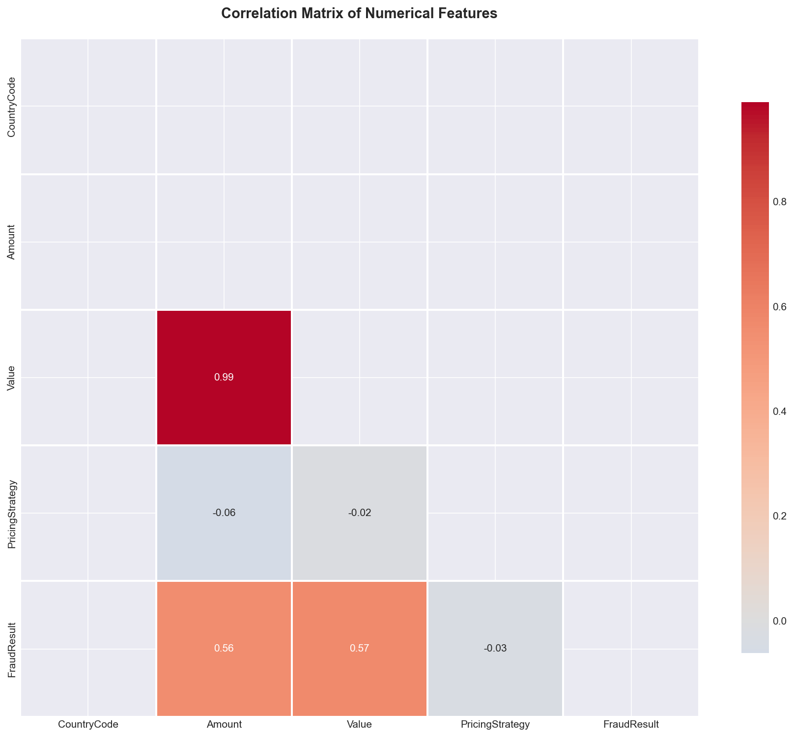
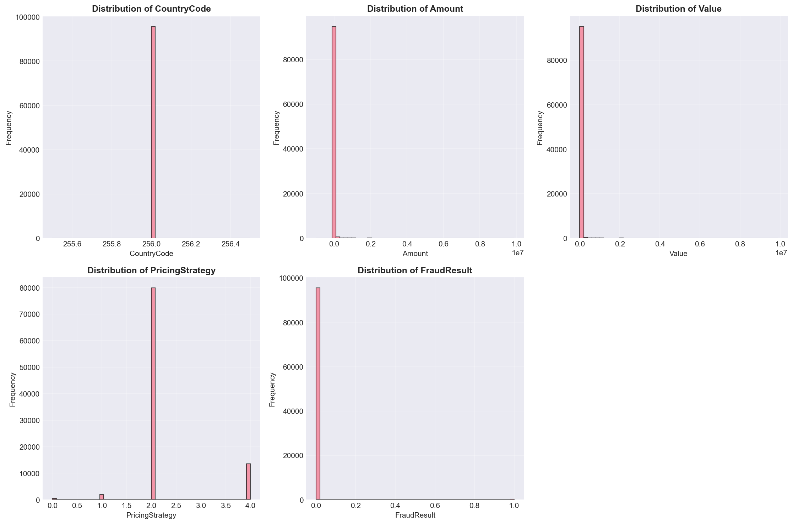

# Credit Risk Probability Model for Alternative Data 🚀💳

An End-to-End Implementation for Building, Deploying, and Automating a Credit Risk Model

## Overview

### Business Need

You are an Analytics Engineer at **Bati Bank**, a leading financial service provider with over 10 years of experience. Bati Bank is partnering with an upcoming successful eCommerce company to enable a **buy-now-pay-later** service - to provide customers with the ability to buy products by credit if they qualify for the service. You are assigned a project to create a **Credit Scoring Model** using the data provided by the eCommerce platform.

Credit scoring is the term used to describe the process of assigning a quantitative measure to a potential borrower as an estimate of how likely the default will happen in the future. Traditionally, creditors build credit scoring models using statistical techniques to analyze various information of previous borrowers in relation to their loan performance. Afterward, the model can be used to evaluate a potential borrower who applies for a loan by providing similar information that has been used to build the model. The result is either a score that represents the creditworthiness of an applicant or a prediction of whether an applicant will default in the future.

The definition of default in the context of credit scoring may vary between financial institutions, as long as it complies with the Basel II Capital Accord - you must read [this reference](https://www3.stat.sinica.edu.tw/statistica/oldpdf/A28n535.pdf) to understand the factors the bank needs to take into account to start a new loan procedure. A quick summary of the Basel II Capital Accord can be found in this [reference](https://www.hkma.gov.hk/media/eng/doc/key-functions/financial-infrastructure/alternative_credit_scoring.pdf).

The key innovation lies in transforming behavioral data into a predictive risk signal. By analyzing customer Recency, Frequency, and Monetary (RFM) patterns, we engineer a proxy for credit risk. This allows us to train a model that outputs a risk probability score, a vital metric that can be used to inform loan approvals and terms.

## Project Objectives


1. Defines a proxy variable that can be used to categorize users as high risk (bad) or low risk (good)
2. Select observable features that are good predictors (have high correlation) of the default variable defined in 1)
3. Develop a model that assigns risk probability for a new customer
4. Develop a model that assigns a credit score from risk probability estimates
5. Develop a model that predicts the optimal amount and duration of the loan

## Data and Features

The data for this challenge can be found [here](https://drive.google.com/drive/folders/1xy_fYNlxxHZHXm3BeudObTfz6eC3Oksx). Or you can find it also here: [Xente Challenge | Kaggle](https://www.kaggle.com/datasets/xente-challenge)

### Data Fields

- **TransactionId**: Unique transaction identifier on the platform
- **BatchId**: Unique number assigned to a batch of transactions for processing
- **AccountId**: Unique number identifying the customer on the platform
- **SubscriptionId**: Unique number identifying the customer subscription
- **CustomerId**: Unique identifier attached to Account
- **CurrencyCode**: Country currency
- **CountryCode**: Numerical geographical code of the country
- **ProviderId**: Source provider of the Item bought
- **ProductId**: Item name being bought
- **ProductCategory**: ProductIds are organized into these broader product categories
- **ChannelId**: Identifies if the customer used web, Android, IOS, pay later, or checkout
- **Amount**: Value of the transaction. Positive for debits from the customer account and negative for credits into the customer account
- **Value**: Absolute value of the amount
- **TransactionStartTime**: Transaction start time
- **PricingStrategy**: Category of Xente's pricing structure for merchants
- **FraudResult**: Fraud status of transaction 1 = yes, 0 = No

## Project Structure

```
credit-risk-model/
├── .github/workflows/ci.yml   # For CI/CD
├── data/                       # add this folder to .gitignore
│   ├── raw/                    # Raw data goes here
│   └── processed/              # Processed data for training
├── notebooks/
│   └── eda.ipynb              # Exploratory, one-off analysis
├── src/
│   ├── __init__.py
│   ├── data_processing.py     # Script for feature engineering
│   ├── train.py               # Script for model training
│   ├── predict.py             # Script for inference
│   └── api/
│       ├── main.py            # FastAPI application
│       └── pydantic_models.py # Pydantic models for API
├── tests/
│   └── test_data_processing.py # Unit tests
├── Dockerfile
├── docker-compose.yml
├── requirements.txt
├── .gitignore
└── README.md
```

## Credit Scoring Business Understanding

### 1. How does the Basel II Accord's emphasis on risk measurement influence our need for an interpretable and well-documented model?

The Basel II Capital Accord establishes a comprehensive framework for banking supervision that emphasizes three fundamental pillars: minimum capital requirements, supervisory review, and market discipline. This regulatory framework fundamentally changes how banks approach risk management, particularly credit risk.

**Risk Measurement Requirements:**
Basel II mandates that financial institutions must have robust internal risk measurement systems. The accord requires banks to demonstrate that their risk models are not only accurate but also transparent and auditable. This means that:

- **Regulatory Compliance**: Banks must be able to explain their risk assessment methodologies to regulators. An interpretable model allows auditors and supervisors to understand how credit decisions are made, ensuring compliance with capital adequacy requirements.

- **Capital Allocation**: The accord links capital requirements directly to risk estimates. If a model cannot be interpreted, regulators cannot verify whether capital reserves are appropriately calculated, potentially leading to regulatory penalties or increased capital requirements.

- **Model Validation**: Basel II requires ongoing model validation and backtesting. Interpretable models facilitate this process by allowing risk managers to understand model behavior, identify potential biases, and ensure the model performs as expected across different economic conditions.

- **Documentation Standards**: The supervisory review process (Pillar 2) requires extensive documentation of model development, assumptions, and limitations. A well-documented model is essential for demonstrating due diligence and maintaining regulatory approval.

In our context, using alternative data (eCommerce transaction behavior) to predict credit risk is innovative but also introduces additional scrutiny. Regulators need to understand how behavioral patterns translate to creditworthiness, making interpretability not just a best practice but a regulatory necessity.

### 2. Since we lack a direct "default" label, why is creating a proxy variable necessary, and what are the potential business risks of making predictions based on this proxy?

**Necessity of Proxy Variables:**

In traditional credit scoring, default labels are derived from actual loan repayment histories. However, in this project, we're working with eCommerce transaction data where no direct loan default information exists. Creating a proxy variable becomes essential because:

- **Model Training Requirement**: Supervised learning models require labeled data. Without a proxy variable that represents credit risk, we cannot train a predictive model. The proxy serves as our target variable, enabling us to learn patterns from historical behavior.

- **Business Logic Translation**: We need to translate observable behaviors (transaction patterns, RFM metrics) into a credit risk signal. A well-designed proxy variable captures the essence of creditworthiness using available data—for example, customers with frequent late payments, high fraud rates, or irregular spending patterns might be considered higher risk.

- **Innovation in Credit Assessment**: Alternative data sources (like eCommerce behavior) represent a paradigm shift in credit assessment. Proxy variables allow us to leverage this rich behavioral data to make credit decisions for customers who may not have traditional credit histories.

**Potential Business Risks:**

However, relying on proxy variables introduces several significant risks:

- **Misclassification Risk**: A proxy variable is an approximation of true credit risk. If the proxy is poorly designed, we may incorrectly label customers as high or low risk, leading to:

  - **False Positives**: Rejecting creditworthy customers, resulting in lost revenue and customer dissatisfaction
  - **False Negatives**: Approving risky customers, leading to higher default rates and financial losses

- **Model Drift**: The relationship between the proxy and actual credit risk may change over time. Economic conditions, customer behavior evolution, or changes in the eCommerce platform could make the proxy less predictive, requiring constant monitoring and recalibration.

- **Regulatory and Fairness Concerns**: If the proxy variable inadvertently captures protected characteristics (e.g., through geographic or demographic correlations), the model could violate fair lending laws. Regulators may question the validity of proxy-based models, especially if they cannot be validated against actual default outcomes.

- **Business Model Risk**: The proxy variable represents our hypothesis about what constitutes credit risk. If this hypothesis is wrong, the entire business model could fail. For instance, if we assume that high transaction frequency indicates creditworthiness, but it actually correlates with financial distress (excessive spending), we would make systematically poor decisions.

- **Validation Challenges**: Without actual default data, we cannot directly validate our proxy. We must rely on indirect validation methods (e.g., correlation with known risk factors, expert judgment, or limited pilot programs), which are inherently less reliable than direct validation.

To mitigate these risks, we must carefully design the proxy variable using domain expertise, validate it through multiple methods, and continuously monitor model performance in production.

### 3. What are the key trade-offs between using a simple, interpretable model (like Logistic Regression with WoE) versus a complex, high-performance model (like Gradient Boosting) in a regulated financial context?

**Simple, Interpretable Models (Logistic Regression with Weight of Evidence):**

**Advantages:**

- **Regulatory Compliance**: Logistic regression models are easily explainable. Each feature's contribution to the final score can be precisely quantified, making it straightforward to explain decisions to regulators, auditors, and customers. This aligns perfectly with Basel II's emphasis on transparency and documentation.

- **Stability and Reliability**: Simple models are less prone to overfitting and tend to be more stable across different data distributions. This is crucial in financial contexts where model stability directly impacts business operations.

- **Feature Engineering Transparency**: With WoE (Weight of Evidence) transformation, the relationship between features and the target variable is explicit. Business stakeholders can understand which customer behaviors drive credit decisions, facilitating business strategy alignment.

- **Easier Validation**: The linear nature of logistic regression makes it easier to validate assumptions, test for multicollinearity, and ensure statistical soundness—all important for regulatory approval.

- **Lower Computational Cost**: Simple models require less computational resources for training and inference, reducing operational costs.

**Disadvantages:**

- **Limited Predictive Power**: Logistic regression assumes linear relationships and cannot capture complex non-linear interactions between features. This may result in lower predictive accuracy, potentially leaving money on the table or misclassifying edge cases.

- **Feature Engineering Burden**: To achieve reasonable performance, extensive feature engineering is required. This increases development time and complexity, even if the final model is simple.

- **Limited Adaptability**: Simple models may struggle to adapt to changing patterns in alternative data, which can be highly non-linear and feature-rich.

**Complex, High-Performance Models (Gradient Boosting):**

**Advantages:**

- **Superior Predictive Performance**: Gradient boosting models can capture complex non-linear relationships and feature interactions automatically, often achieving significantly higher accuracy than linear models. This can directly translate to better risk assessment and reduced losses.

- **Automatic Feature Interaction**: These models can discover complex patterns in data that would be difficult to engineer manually, potentially uncovering valuable signals in alternative data.

- **Handles Non-Linearity**: Alternative data from eCommerce platforms often contains non-linear patterns (e.g., spending behavior thresholds, seasonal effects). Gradient boosting can model these naturally.

**Disadvantages:**

- **Interpretability Challenges**: Gradient boosting models are "black boxes." Understanding why a specific customer received a particular score is difficult, which creates challenges for:

  - Regulatory approval and audits
  - Customer communication (especially for adverse actions)
  - Model validation and monitoring
  - Identifying and correcting biases

- **Regulatory Risk**: Regulators may be hesitant to approve models that cannot be fully explained. This could delay deployment or require additional validation efforts.

- **Overfitting Risk**: Complex models are more prone to overfitting, especially with limited data. This can lead to poor generalization and unexpected performance degradation in production.

- **Higher Maintenance Burden**: Complex models require more sophisticated monitoring, validation, and recalibration processes, increasing operational complexity and cost.

**The Hybrid Approach:**

In practice, many financial institutions adopt a hybrid approach:

1. **Use complex models for initial screening** to maximize predictive power
2. **Use interpretable models for final decisions** or as a validation layer
3. **Employ model explainability techniques** (SHAP values, LIME) to provide post-hoc explanations for complex models
4. **Develop scorecards** that translate complex model outputs into interpretable rules

For this project, given the regulatory context and the need for transparency, we might start with a logistic regression model with WoE transformation. If performance is insufficient, we can explore gradient boosting with extensive explainability analysis, or use gradient boosting for feature selection and then build a logistic regression model on the selected features.

The ultimate choice depends on balancing regulatory requirements, business performance needs, and available resources for model maintenance and validation.

## EDA Visuals 📊🖼️

Below are key visual summaries from the exploratory analysis:

- Correlation heatmap (Amount vs Value)  
  

- Numerical distributions (skewness and tails)  
  

- Categorical distributions (ProductCategory, ChannelId)  
  

- Pie charts for key categorical features  
  

- Box plots for outlier detection  
  

## Getting Started

### Installation

```bash
# Create virtual environment
python -m venv venv
source venv/bin/activate  # On Windows: venv\Scripts\activate

# Install dependencies
pip install -r requirements.txt
```

### End-to-End Usage

1. **Process data & create proxy target**
   ```bash
   python src/process_data.py --raw_path data/raw/data.csv --output_path data/processed/processed.csv
   ```
2. **Train model with MLflow logging & save local artifact**
   ```bash
   python src/train.py data/processed/processed.csv is_high_risk logistic
   # local model saved to models/best_model; MLflow run logged to default store
   ```
3. **Run API (uses MODEL_URI env or local fallback)**
   ```bash
   MODEL_URI=models:/credit-risk-model/Production uvicorn src.api.main:app --host 0.0.0.0 --port 8000
   # or rely on local models/best_model if MODEL_URI is not set
   ```
4. **Sample predict request (JSON)**
   ```json
   {
     "customer_id": "C123",
     "features": {
       "ProductCategory": "financial_services",
       "ChannelId": "3",
       "Amount": 1500,
       "Value": 1500,
       "PricingStrategy": 2
     }
   }
   ```
5. **Run tests**
   ```bash
   pytest -v
   ```

## References

- [RFMS Method for Credit Scoring Based on Bank Card Transaction Data](https://www3.stat.sinica.edu.tw/statistica/oldpdf/A28n535.pdf)
- [Alternative Credit Scoring](https://www.hkma.gov.hk/media/eng/doc/key-functions/financial-infrastructure/alternative_credit_scoring.pdf)
- [Credit Scoring Approaches Guidelines](https://thedocs.worldbank.org/en/doc/935891585869698451-0130022020/original/CREDITSCORINGAPPROACHESGUIDELINESFINALWEB.pdf)
- [How to Develop a Credit Risk Model and Scorecard](https://towardsdatascience.com/how-to-develop-a-credit-risk-model-and-scorecard-91335fc01f03)
- [Credit Risk - Corporate Finance Institute](https://corporatefinanceinstitute.com/resources/commercial-lending/credit-risk/)
- [What is Credit Risk?](https://www.risk-officer.com/Credit_Risk.htm)

